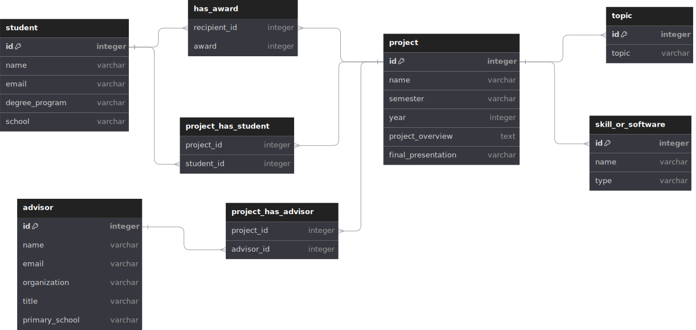

# Database Schema

This database is designed to store information about the previous projects and help to improve the future projects.

This database will be use by the following applications:

- dataFestArchive: This project
- dataFestDashboard: The dashboard to display the data written in [Tableau](https://www.tableau.com/)

## Questions

Write down the questions that you want to answer with this database.

### Project questions

- What projects have been done in the past?
- What project have been won in the past?
- What the categories of the projects that have been won in the past?

### Skill questions

- What are the skills that are required for the projects?
- What are the skills that are required for the projects that have been won?

### Advisors

- Who are the advisors that have been involved in the past?
- Who are the advisors that have been involved in the past and have won?
- Who are the advisors that have been involved in the past and have won multiple times?
- Who are the advisors that have been involved in the past and have won multiple times with different teams?

## Database Schema

